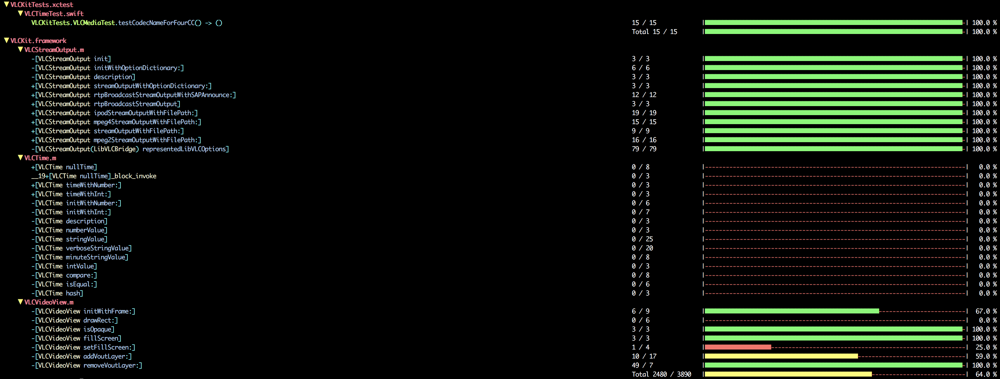
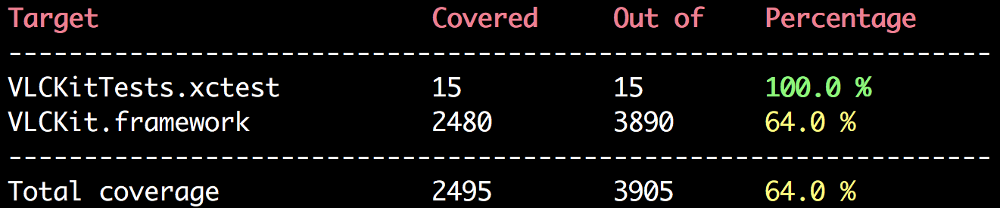

<p align="center">
  
  <br>
  <p align="center">
    <a href="https://travis-ci.org/mkchoi212/xcperfect">
      
    </a>
    <a href="https://badge.fury.io/rb/xcperfect">
      
    </a>
  </p>
</p>
<br>

## Installation

```bash
$ gem install xcperfect
```

## Usage

- Pipe

```bash
$ xcrun xccov --json [options] | xcperfect [options]
```

- Feed it in via flags

```bash
$ xcperfect [--file | -f] report.json [options]
```

> ⚠️ Please note that `xcperfect` only takes in `xccov` json output

## Formats

- `--all`, `-a` **Default**



- `--simple`, `-s`



## ✋ Contributing

This is an open source project so feel free to contribute by

- Opening an [issue](https://github.com/mkchoi212/xcperfect/issues/new)
- Sending me feedback via [email](mailto://mkchoi212@icloud.com)
- Or [tweet](https://twitter.com/Bananamlkshake2) at your boi!

## LICENSE

Please look at [LICENSE.md](./LICENSE.md)

